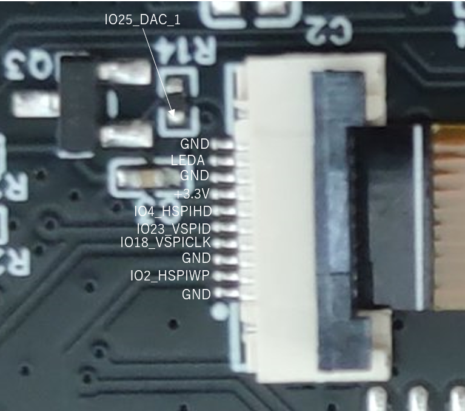
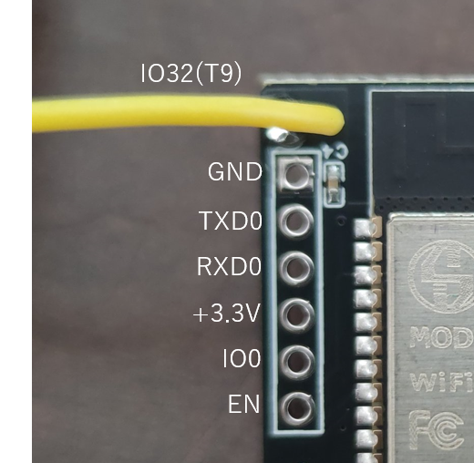

# ESP32 GMT154-06 LCD プロジェクト集

このリポジトリは、ESP32マイコンとGMT154-06 LCDパネルを使用した様々なプロジェクトを収録しています。初心者から上級者まで、様々なレベルのサンプルコードを提供しています。

## ハードウェア要件

- ESP32開発ボード
- GMT154-06 LCDパネル
- デバッグボード(UART-USB変換)

## 接続方法

LCDパネルとESP32の接続は以下の通りです：

| LCD ピン | ESP32 ピン |
|---------|-----------|
| RESET   | IO4       |
| D/C     | IO2       |
| DATA    | IO23      |
| CLK     | IO18      |
| バックライト | IO25      |

デバッグボードとESP32の接続は以下の通りです

| デバッグポート | ESP32 |
|---------|-----------|
| Touch   | IO32      |
| GND     | GND       |
| TXD0    | IO1       |
| RXD0    | IO3       |
| +3.3V   | 3V3       |
| IO0     | IO0       |
| EN      | EN        |

## ソフトウェア要件

- PlatformIO
- Arduino Framework for ESP32
- 各プロジェクトに必要なライブラリ（TFT_eSPI、LovyanGFXなど）

## プロジェクト一覧

このリポジトリには以下のプロジェクトが含まれています：

### 1. ESP32_GMT154-06_test

`examples/ESP32_GMT154-06_test` ディレクトリにあります。

ESP32とGMT154-06 LCDパネルを使用して「Hello World」を表示する基本的なサンプルプログラムです。TFT_eSPIライブラリを使用しています。

### 2. ESP32_GMT154-06_LovyanGFX_test

`examples/ESP32_GMT154-06_LovyanGFX_test` ディレクトリにあります。

LovyanGFXライブラリを使用したGMT154-06 LCDパネルのテストプログラムです。グラフィックス機能をテストするためのサンプルが含まれています。

### 3. ESP32_GMT154-06_Avatar

`examples/ESP32_GMT154-06_Avatar` ディレクトリにあります。

LovyanGFXとM5Stack-Avatarライブラリを使用して、GMT154-06 LCDパネルにアバターを表示するプロジェクトです。IO32ピンのタッチセンサーを使用して、アバターの表情を変更できます。

### 4. ESP32_NTP_AnalogClock

`examples/ESP32_NTP_AnalogClock` ディレクトリにあります。

ESP32＋LovyanGFXでNTP時刻をアナログ時計表示。Web UIからWiFi設定、OTAアップデート、タッチセンサーで設定モード切替が可能なサンプルです。

### 5. ESP32_NTP_AnalogClock_classic

`examples/ESP32_NTP_AnalogClock_classic` ディレクトリにあります。

ESP32とLovyanGFXライブラリを使用したクラシックデザインのNTPアナログ時計です。伝統的な時計デザインを採用し、高精度な针の動きと美しい表示を実現しています。非同期Web機能も備えています。

### 6. ESP32_NTP_AnalogClock_SmartWatch

`examples/ESP32_NTP_AnalogClock_SmartWatch` ディレクトリにあります。

ESP32とLovyanGFXライブラリを使用したスマートウォッチ風デザインのNTPアナログ時計です。黒背景に白いマーカーと針を使用したミニマルなデザインを採用し、モダンな印象を与えます。非同期Web機能も備えています。

## ビルド方法

1. PlatformIOをインストールします
2. このリポジトリをクローンまたはダウンロードします
3. 使用したいプロジェクトのディレクトリをPlatformIOで開きます
4. ビルドしてESP32にアップロードします

## 各プロジェクトの詳細

### ESP32_GMT154-06_test

基本的なTFT_eSPIを使用したサンプルです。起動後、LCDパネルに「Hello World」と接続情報が表示されます。

### ESP32_NTP_AnalogClock（NTPアナログ時計 with Web設定 & OTA）

ESP32とLovyanGFXライブラリを使い、NTPサーバーから取得した時刻をアナログ時計としてLCDに表示するサンプルです。

**主な特徴：**
- Web UIからWiFi設定可能
- OTA（無線アップデート）対応
- タッチセンサーで設定モード切替
- 1時間ごとに自動NTP再同期
- ST7789搭載240x240 LCD向け

**セットアップ概要：**
1. PlatformIOで書き込み
2. 初回起動時またはタッチしながら起動で設定モード（AP）
3. スマホ等で `ESP32-Clock-Setup` WiFiに接続し、Web UIからWiFi設定
4. 通常時はNTP同期しアナログ時計表示

詳細は [`examples/ESP32_NTP_AnalogClock/README.md`](examples/ESP32_NTP_AnalogClock/README.md) を参照してください。

### ESP32_GMT154-06_LovyanGFX_test

LovyanGFXライブラリを使用したサンプルです。グラフィックス機能をテストするためのサンプルが含まれており、テキスト、図形、アニメーションなどの表示を確認できます。

### ESP32_GMT154-06_Avatar

M5Stack-AvatarライブラリをLovyanGFXで動作するように移植したプロジェクトです。以下の機能が含まれています：

- 240x240ピクセルのGMT154-06 LCDディスプレイでのアバター表示
- IO32（T9）タッチセンサーによる表情切り替え（0.3秒タッチで切り替え）
- 表情はNeutral、Happy、Sleepy、Sad、Doubtの5種類
- アバターのサイズは80%に縮小
- 口の動きはランダムに変化

## トラブルシューティング

- ディスプレイが表示されない場合は、接続を確認してください
- タッチセンサーが動作しない場合は、コード内のタッチしきい値を調整してみてください
- ライブラリのインストールに問題がある場合は、PlatformIOのライブラリマネージャーを使用して手動でインストールしてみてください

## 貢献とフィードバック

プルリクエストやイシューは大歓迎です。このリポジトリを改善するためのアイデアや提案があれば、お気軽にお知らせください。
